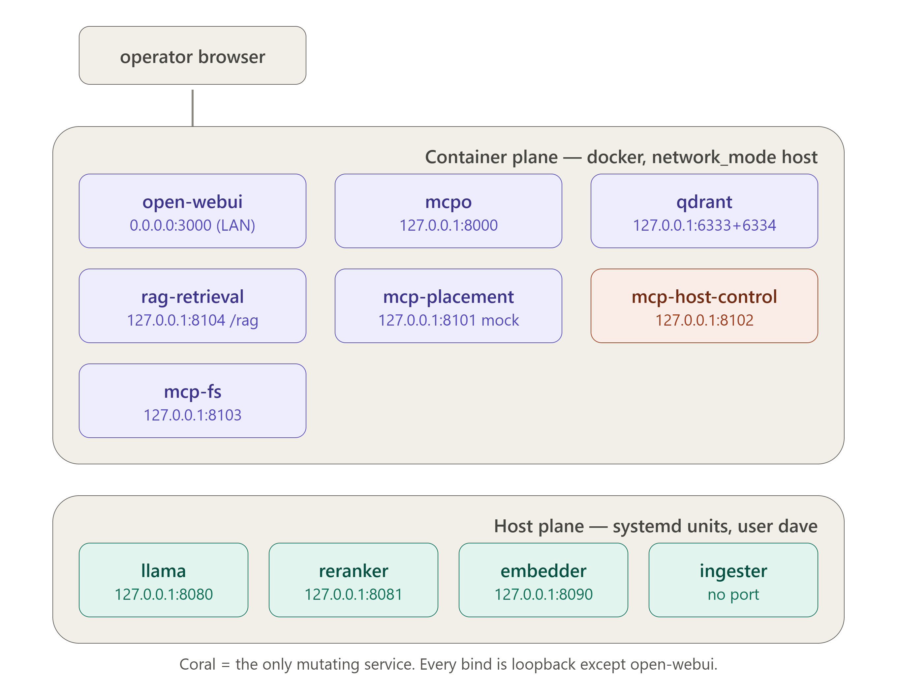
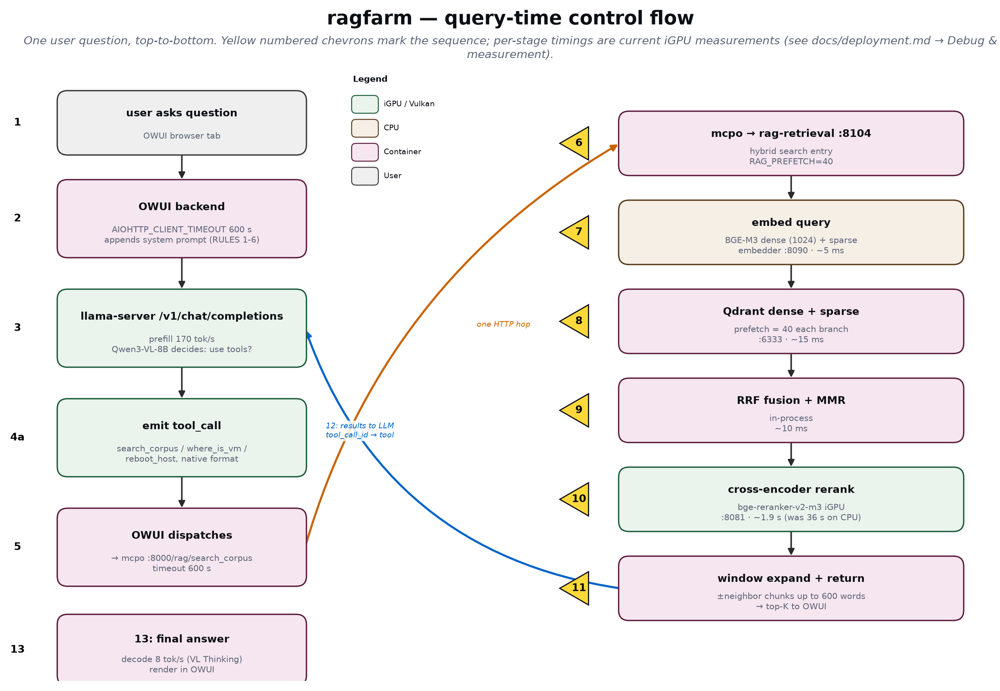
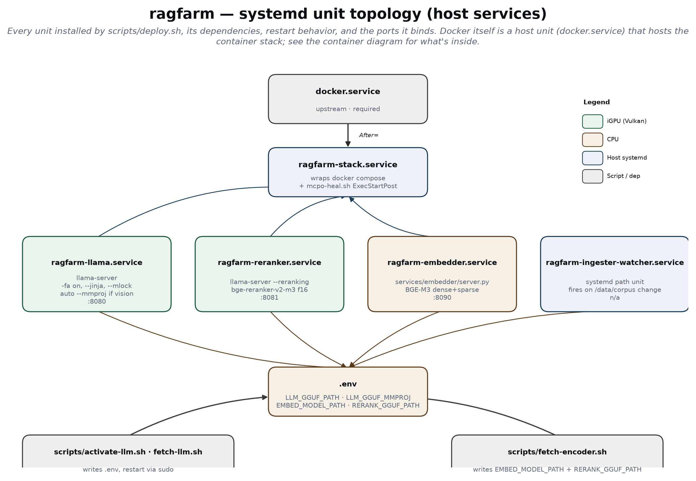
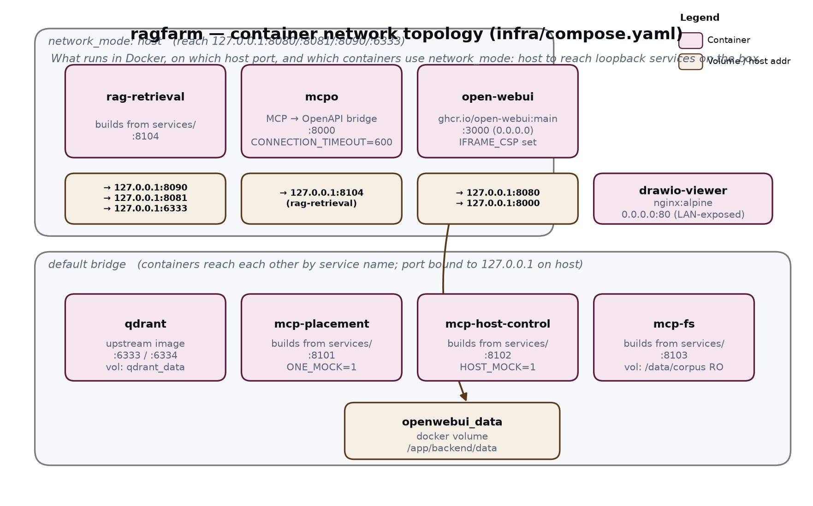

# ragfarm — on-prem RAG + infra-control agent for AMD Ryzen AI 9 HX 370
Author: David Kubicek (david.kubicek@eywo.cz)

This software is provided under the terms of the MIT license [`docs/prompts.md`](blabla) [`LICENSE.txt`].

A fully on-prem retrieval-augmented assistant for a customer VM farm. It answers
questions over thousands of internal documents/notes **and** lets infra admins
ask operational questions in natural language ("where is VM1 running?",
"reboot host X") which are dispatched through MCP microservices to the
infrastructure control plane (OpenNebula).

## Hardware target (PoC)
- **AceMagic F5X**, AMD **Ryzen AI 9 HX 370** (Strix Point, "STX")
  - 12 cores (4× Zen 5 + 8× Zen 5c), Radeon **890M** iGPU (RDNA 3.5, gfx1150),
    **XDNA 2 NPU** (50 TOPS INT8)
- OS: **Ubuntu 24.04 LTS**, kernel **≥ 6.10**, Python **3.12.x**, 64 GB RAM recommended

## The one architectural fact that drives everything
On **Linux**, AMD Ryzen AI 1.7.1 supports an **NPU-only LLM flow**. There is
**no hybrid single-model NPU+iGPU split on Linux** — that flow is Windows-only.
Also, AMD's own stack states **llama.cpp reaches the iGPU only, never the NPU**.

Because the architecture is designed to be completely durable, it can be deployed on
a much more powerful NVIDIA hardware, while at the same time in this PoC state, runs
file on a tiny 7B model and Vulkan-accelerated llama.cpp via Vuklan on AMD's
AI 9 HX 370 CPU with 64GB RAM and an integrated iGPU Radeon 890M. The switch to
the production HW means a simple replacement of the inference engine with vLLM, which
can exploit multi-GPU tensor parallelism as well as data parallelism and performs with
2-3x higher throughput on a comparable HW. Prodution NVIDIA HW will allow for CUDA
acceleration and combined HCP/HA-like modes, easily fitting a 30B in case of a single
GPU like L40S and a 70B with 2-4 RTX PRO 6000 Blackwell Max-Q/Server cards.

All practical test prove the bottleneck for inference and training especially is
the RAM-CPU-VRAM bandwidth. Desktop/notebook PC's with however powerful GPU are out
of their depth. Reasonable required GPU bus speeds are in the 900 Gbps neighborhood,
with bandwiths aroud 1.5 Tbsp being much safer bet for multi-user environments, requiring
LoRA fine-tuning, low latency, concurrency, bulky RAG and agentic execution. For that use
case specifically, a dual 30B+70B model is the norm these days. In summary if we want
snappy inference injected by highly targeted RAG, multiple MCPs with many tools and
possibly even LangGraph orchestrator of agentic behavior, then 4x of the aforementioned
Blackwells are the bare minimum. If customer can afford it, 1x H200's would do almost
the same job (compute ratio of 6000 Blackwell vs. H200 is about 1:2.5). But this has more
to do with the fact that H200 are not PCIe cards, but use NVIDIA's SXM fabric, which in
H200's case means 1.8 Terabytes/s bi-directional bandwidth over NVLink 5 interconnect.
Even inference isn't compure-bound, LLM are bandwith-bound in every application. You
can see how measly DDR7 VRAM of the state of the art 6000 Blackwells cannot hold a candle
to the high-end models with their brutal com links.

We originally split the workload acrosss GPU, CPU, and APU provided by modern AMD AI
chipsets by *role*, but this proved to be futile, since NPU is too small to accomodate
a multi-lingual embedder of the size required by our infra documentation:
- **iGPU (890M, Vulkan)** runs the generative LLM (good decode bandwidth) — `llama-server`.
- **NPU (XDNA 2)** runs the embedding/encoder model for the ingester (efficient prefill, low watts) — RyzenAI EP.
- **CPU (Zen 5)** runs Qdrant, the MCP services, and orchestration.

Current placement had to develop as follows (which aligns perfectly with future NVIDIA HW):
- **iGPU** - llama.cpp with 7B Qwen2.5-Instruct + llama.cpp with BME-reranker-v2-m3
  The reranker used to be on the CPU, but experiments showed us than even after colocating
  big LLM and reranker LLM on the same silicon, cross-ranking times for 40-50 RAG results
  fetched from Qdrant went down from drastically from almost 40sec to 1sec per prompt. The
  other times measure each major block of our custom RAG pipeline. Yes, lots of algorithimic
  jiggery pokery happeds in there; without all of it the results weren't any better than what
  Google serves you. :)

```
CPU: timing_ms: {embed: 215,   fuse: 17,   rerank: 36082,   expand: 6}
GPU: timing_ms: {embed: 183.5, fuse: 15.3, rerank:  1287.2, expand: 5.7}
```

See `docs/decisions/ADR-0001-engine-split.md` for the full rationale and the
measured numbers that justify it.

## Layout
- `docs/` — salvaged AMD reference material + architecture decisions + complete topology rerefence
- `infra/` — compose stack, llama build/launch, NPU driver install (custom code, opensource inference engine)
- `models/` — GGUF (iGPU LLM) and BF16 OGA encoder (not repo-synced, lives entirely on the deployment host)
- `services/` — all custom microservices + ingester + RAG pipeline, etc.
- `manifests/` — systemd units / env manifests per service
-  tests/ - reference documents with the worst culture we could find (for fine-tuning parsing, chunking, RAG)
-  scripts/ - helper tools for managing `ragfarm`, debug tools, tracing & timing tools for LLM benching

## Diagrams

### Runtime component inventory



### Query-time control flow



### Systemd unit topology (host services)



### Container network topology (infra/compose.yaml)



## Working chat examples (verified in OWUI)

Nine screenshots below are all from the deployed Open WebUI, driving the text-tuned
Qwen2.5-7B preset (`ragfarm (corpus RAG + infra)`) on this exact stack. Every
question was answered live — no editing. They exist here as (a) proof the current
system does what the docs describe, and (b) the source of truth for the
prompt-by-prompt commentary in [`docs/prompts.md`](docs/prompts.md).

### 1. Firewall rules for a specific host (RAG → structured table)

**Prompt:** `Jaká jsou FW pravidla pro host leadb229p.lea.piz?`


Model calls `search_corpus`, gets 6 firewall-rule rows back, renders them as a
markdown table with every column (Source/Destination Network Address(es) and
Name(s), Destination Port(s), Protocol) — no dropped fields. Ends with a
one-line source citation identifying the .xlsx it came from.

### 2. Contacts for the EPC project team (RAG → per-person structured list)

**Prompt:** `Dej mi kontakty na projektove vedeni v EPC.`


Six people, each rendered as Firma / Role/oblast / Tel / E-mail. Phone numbers
appear where present in source; the two people whose corpus row lacks a phone
number simply don't get the field (no hallucination).

### 3. Deep host lookup — 19 fields for one server (RAG → keyed detail view)

**Prompt:** `Co vis o hostu acclcass1?`


Prostředí, OS, Virtualizace, Storage, vCPU, RAM, HDD, Support, T-S Hostname/IP/Netmask,
SA Hostname/domain/IP/Netmask/VLAN ID, Storage OS+App/Data, filesystem, UID — all
recovered from the source spreadsheet's row for this host, verbatim.

### 4. Where credentials live (RAG + procedural answer)

**Prompt:** `Kde ukládáme hesla pro EPC?`


Answers where (NordPass), which record name to look for ("RDP User"), and how
that password fits into the RDP-to-terminal-server workflow.

### 5. Documentation Git repository (RAG → exact URL)

**Prompt:** `Kde máme uložené GIT repo s dokumentací?`


Exact repository URL retrieved verbatim from the corpus.

### 6. Access flow from ŠA into EPC (RAG → 6-way procedural breakdown)

**Prompt:** `Jak se přihlásím ze ŠA do EPC?`


Six numbered login methods (SSH direct, RDP direct, via terminal servers, GUI,
reverse proxy, CLI), each with the exact hostnames, IPs, credentials source, and
pointers back to the source spreadsheets (`EPC25_VMs_config.xlsx`,
`SA_Hosting_infra_VMs.xlsx`).

### 7. Tool discipline: time query, out-of-corpus refusal, gated reboot

**Prompts** (multi-turn):
`Rebootuj host node-03.` · `Kolik je hodin?` · `Kdo je prezident USA?` · `Rebootuj host node-03.`


Four turns in one image. Reboot fires the `reboot_host` tool (returns success
with live-migration report of `sftp-gw`). Time query fires
`get_current_timestamp`. **"Who is the president of the USA?"** correctly returns
a graceful miss (`V dokumentu není zmíněn žádný prezident USA`) instead of
hallucinating a name — this is the target behavior for anything outside the
corpus. Fourth turn reboots the same host again, cleanly.

### 8. Diagram generation — dependency tree from a natural-language sentence

**Prompt:** `Vygeneruj stromový diagram slovních vazeb ve větě: "Once upon a time there was a very little dog called Steven who owned a nice little yellow car".`


Mermaid syntax rendered inline in-chat by OWUI as an interactive SVG. Notice
this is a real dependency tree, not a linear word chain: `dog` is a hub with
`a`/`very`/`little`/`called Steven` branching off; `owned` hangs from `who`; the
second `a` is its own hub for `car`. This shape is what took several rounds of
system-prompt tuning to reach reliably.

### 9. Code generation with in-chat execution

**Prompt:** `Vygeneruj mi kód pro quicksort a otestuj ho spuštěním nad malým polem náhodných řetězců. Prezentuj kód a výsledné pořadí tříděného pole po běhu sortu.`


Model writes a complete quicksort in Python, OWUI's built-in code interpreter
runs it, and the sorted output appears inline as a data grid. Same
sampling-deterministic path is used for `RULE 5` in the system prompt (write →
execute → report + benchmark).

## Network / proxy
Outbound build traffic (PyPI, HuggingFace, container builds) honors a proxy via
repo-root `.env` (gitignored, host-only — copy `.env.example`). Set `HTTP_PROXY`,
`HTTPS_PROXY`, and optionally `NO_PROXY` there, then **source the loader before any
networked build command**:

```bash
source scripts/proxy-env.sh        # loads .env, exports HTTP(S)_PROXY + NO_PROXY
pip install -U FlagEmbedding ...   # now goes through the proxy
docker compose -f infra/compose.yaml up -d   # containers inherit the proxy
```

The loader always merges an internal-host baseline
(`localhost,127.0.0.1,::1,host.docker.internal,qdrant`) into `NO_PROXY`, so the
stack's many localhost/inter-container calls (ingester→`:8090`/`:6333`, probes,
`search_corpus`→Qdrant, Open WebUI→`:8080`, mcpo→MCP) never route at the proxy.
List only *additional* bypass targets (on-prem LAN / OpenNebula subnet) in `.env`.

Container image **pulls** go through the Docker daemon, not these vars — if your
registry is reachable only via proxy, configure the daemon separately
(`/etc/systemd/system/docker.service.d/http-proxy.conf`).

## Where to start (humans and agents)
Read `docs/deployment.md` for currently running services, network contact points,
web frontend access, managing the whole stack lifecycle, documentations of all
scripts and development debug tools. Then `docs/decisions/ADR*` for architecural
decisions and planning.

Build progress and Claude contracts for grounding the AI in the latest project
status live in `CLAUDE.md` and `BUILD_STATUS.md`. These files are strictly for AIs,
humans will hardly find them of any use. Perhaps just the final notes and example
commands for every one of the very first steps of the deployment build. The contract
in `CLAUDE.md` is mandatory guidelines preventing any AI from losing focus on current
issues or doing anything that would destroy or corrupt human work. They're also
general instructions of what can and cannot be touched. For example:

- our custom code-base, which is FROZED as far as AIs are concerned
- GIT repo handling and committing discipline
- Never more than a SINGLE writer can touch the topology/repo, enforced  via locking

When we hit a wall, the build stage would be marked BLOCKED and details landed in
`PROGRESS.md`. Those are blockers which even AI cannot handle. And must be fixed
manually.

The current project status: all key architectural decisions have been implemented
(ADR-0001 to ADR-0008) and the LLM works as reliably as can be expected from a 7B
model (Qwen2.5). All the gory details are neatly hidden behind Open WebUI front-end.
RAG chunking and searching is highly optimized for infra documentation and uses
current state-of-the-art algorithms including a specialized rankind model for that
very purpose. We make use of both sparse verctor results (exact lexical matches
against verbatim/XLSX data) and dense fulltext semantic results, fused and optimized
by RRF, MMR reordering and pruning and a dedicated reranker model.
