# ragfarm — on-prem RAG + infra-control agent

Author: David Kubicek (david.kubicek@eywo.cz) · MIT, see [`LICENSE.txt`](LICENSE.txt)

An on-prem retrieval-augmented assistant over a customer VM farm. It answers
questions about thousands of internal documents **and** takes operational
requests in natural language ("where is VM1 running?", "reboot host X"), which
are dispatched through MCP microservices to OpenNebula.

Nothing leaves the box. No per-token cost, no data egress, no vendor dependency
for the working system.

## Hardware

| | |
|---|---|
| **Box** | NVIDIA DGX Spark — GB10 Grace Blackwell, sm_121 |
| **Memory** | 128 GB unified (~121.7 GiB usable), CPU and GPU share it |
| **Bandwidth** | ~273 GB/s spec · **~200 GB/s measured effective** |
| **OS** | Ubuntu 24.04, Python 3.12 |

Previously an AMD Ryzen AI 9 HX 370 mini-PC; that hardware is retired and its
numbers are kept only as the bottom rung of the ladder in
[`docs/pdf/02-hardware-requirements.md`](docs/pdf/02-hardware-requirements.md).

## The one fact that drives every decision

**Decode is memory-bandwidth-bound.** Tokens per second is bandwidth divided by
bytes read per token, and bytes read follows **active** parameters, not total.

Measured here, two models of the same size class:

| model | active bytes/token | tok/s | implied bandwidth |
|---|---|---|---|
| Qwen3-VL-30B-A3B FP8 — MoE, ~3 B active | ~3 GB | **68** | 204 GB/s |
| Qwen3-VL-32B FP8 — dense, 32 B active | ~33 GB | **5.9** | 195 GB/s |

**11.5× apart.** Hence: mixture-of-experts always, dense never, and every "just
add another model" argued against the memory budget rather than against disk.
Sizing formulas and priced hardware options are in chapter 4 of the PDF bundle.

## Engine split (ADR-0013)

| component | runs on | endpoint |
|---|---|---|
| Generative LLM | vLLM, CUDA, NVFP4/FP8 | `127.0.0.1:8080` (+ `:8082` for slot 1) |
| Reranker `bge-reranker-v2-m3` | llama.cpp, CUDA, lowered priority | `127.0.0.1:8081/reranking` |
| Embedder BGE-M3 dense+sparse | CUDA | `127.0.0.1:8090/embed` |
| Qdrant + MCP services | CPU | `:6333`, `:8000`, `:8101-8104` |

Two vLLM **slots** can hold two models at once, switchable mid-conversation with
the context intact — see [`docs/llm-lifecycle.md`](docs/llm-lifecycle.md).

> **sm_121 warning.** A misconfigured NVFP4 MoE on GB10 fails *silently*: the
> model loads and then emits streams of `!!!!!`. Garbage output is a
> backend/kernel problem first, a model problem second.

## Quick start

```bash
scripts/stack.sh status      # 13 services: endpoint, state, depth checks
scripts/stack.sh start       # host services, then containers, then health
```

```bash
scripts/activate_llm.py --status          # slots, models, GPU budget
scripts/activate_llm.py                   # interactive: activate or clear
```

Open WebUI: `http://<host>:3000` — the only LAN-exposed service, login-gated.

Manual pages: `man docs/man1/{stack,activate_llm,fetch_llm,active.json,setup_openwebui,env}.1`

## Retrieval pipeline

BGE-M3 dense (1024-dim) + native sparse → Qdrant two-branch prefetch → RRF
fusion → cross-encoder rerank → floor + Kneedle chord-distance gate → top-k →
same-section expansion. Measured per stage:

```
embed 13 ms · fuse 15 ms · rerank 250 ms · expand <1 ms      (warm; first call after idle ~1.6 s)
```

The reranker is the expensive stage and decides whether the model sees the right
passages at all, so it is never shrunk to buy latency. On the old CPU-only
placement the same stage took **36 seconds**.

## Layout

| path | contents |
|---|---|
| `docs/` | architecture decisions, deployment, prompt library, man pages, measurements |
| `infra/` | compose stack, Open WebUI config, embedder, llama.cpp (reranker) |
| `models/` | checkpoints + `active.json` registry (weights are not repo-synced) |
| `services/` | ingester, RAG pipeline, MCP microservices |
| `manifests/` | systemd units |
| `scripts/` | life-cycle tools, regression suite, benchmarks |
| `tests/` | fixtures, prompt library parser, tracing tools |

## Diagrams

Both are generated from typst sources in [`assets/src/`](assets/src/) — edit the
source and run `assets/src/build.sh`. The four previous diagrams were PNGs with
no source; when generation moved from llama.cpp to vLLM they became wrong and
nobody could fix them.

### Service topology

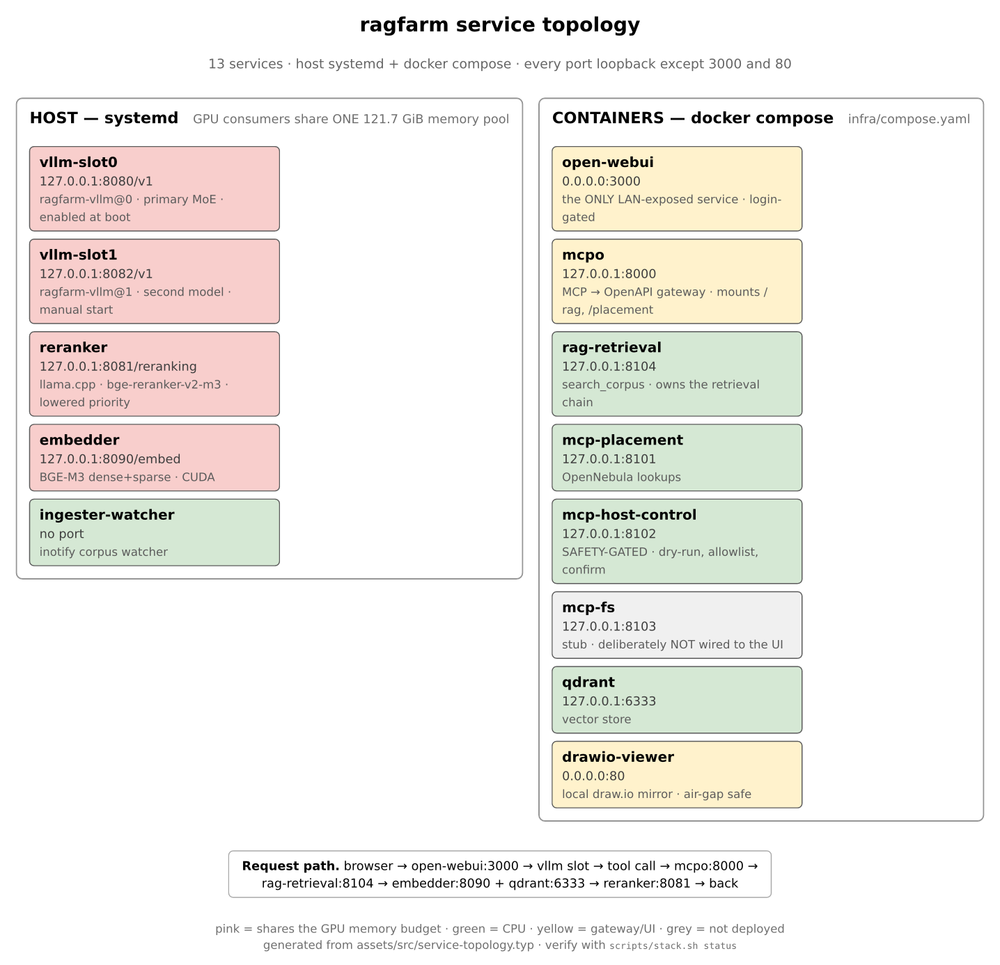

### Query-time retrieval path

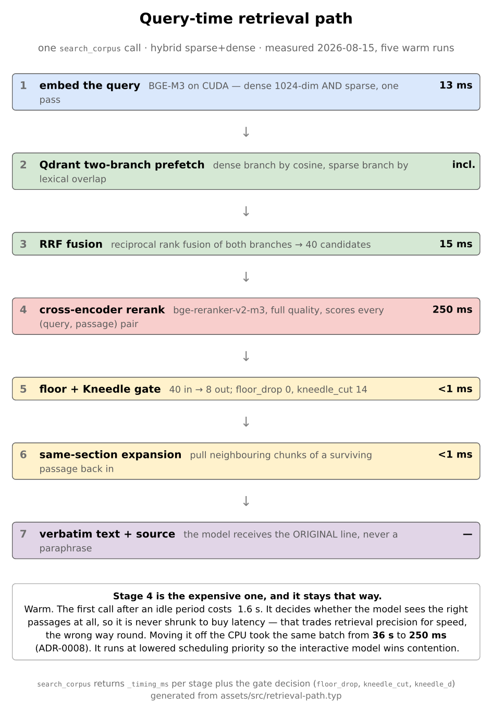

## Working chat examples (verified in OWUI)

Nine screenshots from the deployed Open WebUI. Every question was answered live,
unedited.

> **Provenance, because it matters for what these prove.** These were captured
> 2026-07-27 on the *retired* text preset (Qwen2.5-7B, greedy) on the AMD box.
> They are evidence that the pipeline does what the docs describe, and they are
> the source of the R1-R6 cases in
> [`docs/prompts.md`](docs/prompts.md) — but they are **not** a record of the
> current models. Re-running them against today's stack is what
> `scripts/test_regressions.py` is for.

### 1. Firewall rules for a specific host (RAG → structured table)

**Prompt:** `Jaká jsou FW pravidla pro host leadb229p.lea.piz?`

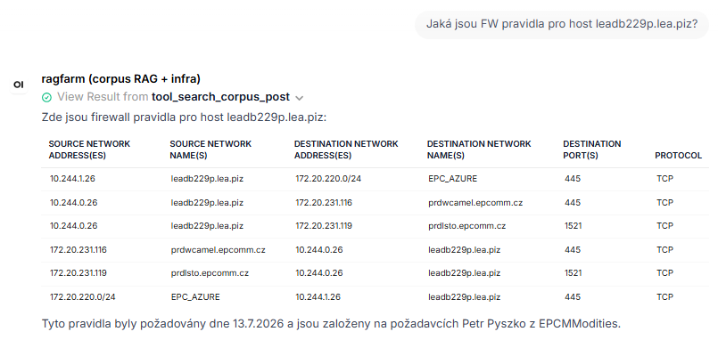

Model calls `search_corpus`, gets 6 firewall-rule rows back, renders them as a
markdown table with every column (Source/Destination Network Address(es) and
Name(s), Destination Port(s), Protocol) — no dropped fields. Ends with a
one-line source citation identifying the .xlsx it came from.

### 2. Contacts for the EPC project team (RAG → per-person structured list)

**Prompt:** `Dej mi kontakty na projektove vedeni v EPC.`

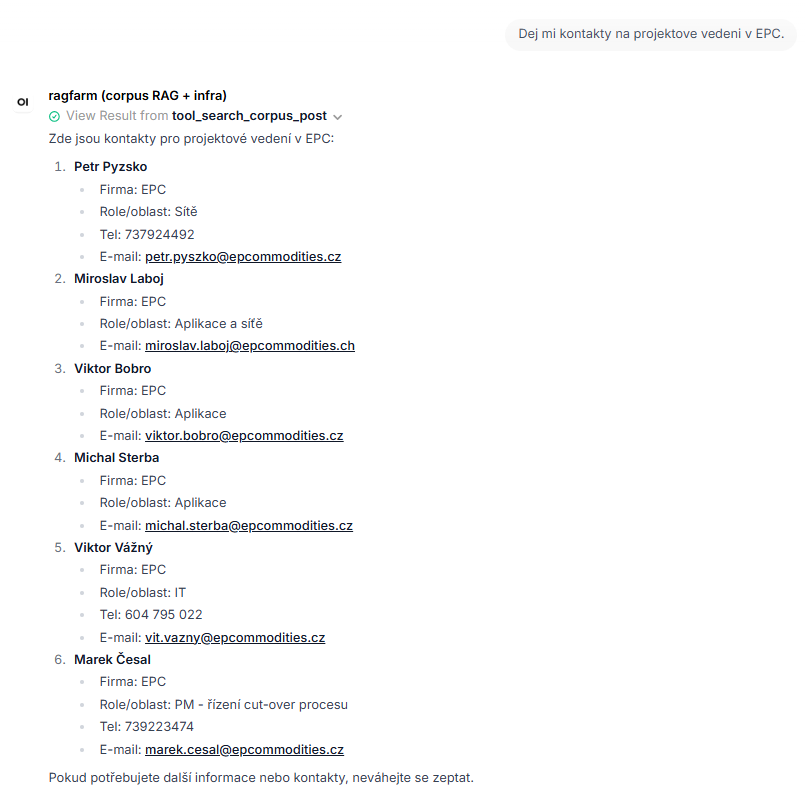

Six people, each rendered as Firma / Role/oblast / Tel / E-mail. Phone numbers
appear where present in source; the two people whose corpus row lacks a phone
number simply don't get the field (no hallucination).

### 3. Deep host lookup — 19 fields for one server (RAG → keyed detail view)

**Prompt:** `Co vis o hostu acclcass1?`

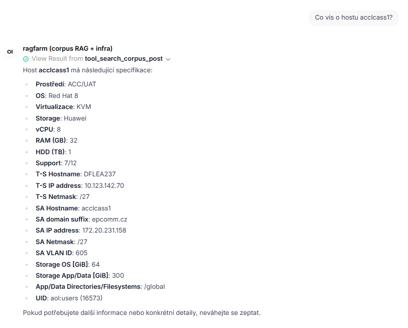

Prostředí, OS, Virtualizace, Storage, vCPU, RAM, HDD, Support, T-S Hostname/IP/Netmask,
SA Hostname/domain/IP/Netmask/VLAN ID, Storage OS+App/Data, filesystem, UID — all
recovered from the source spreadsheet's row for this host, verbatim.

### 4. Where credentials live (RAG + procedural answer)

**Prompt:** `Kde ukládáme hesla pro EPC?`

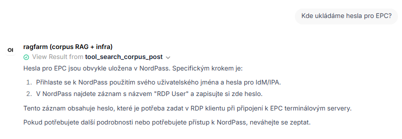

Answers where (NordPass), which record name to look for ("RDP User"), and how
that password fits into the RDP-to-terminal-server workflow.

### 5. Documentation Git repository (RAG → exact URL)

**Prompt:** `Kde máme uložené GIT repo s dokumentací?`

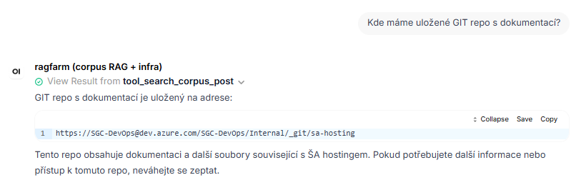

Exact repository URL retrieved verbatim from the corpus.

### 6. Access flow from ŠA into EPC (RAG → 6-way procedural breakdown)

**Prompt:** `Jak se přihlásím ze ŠA do EPC?`

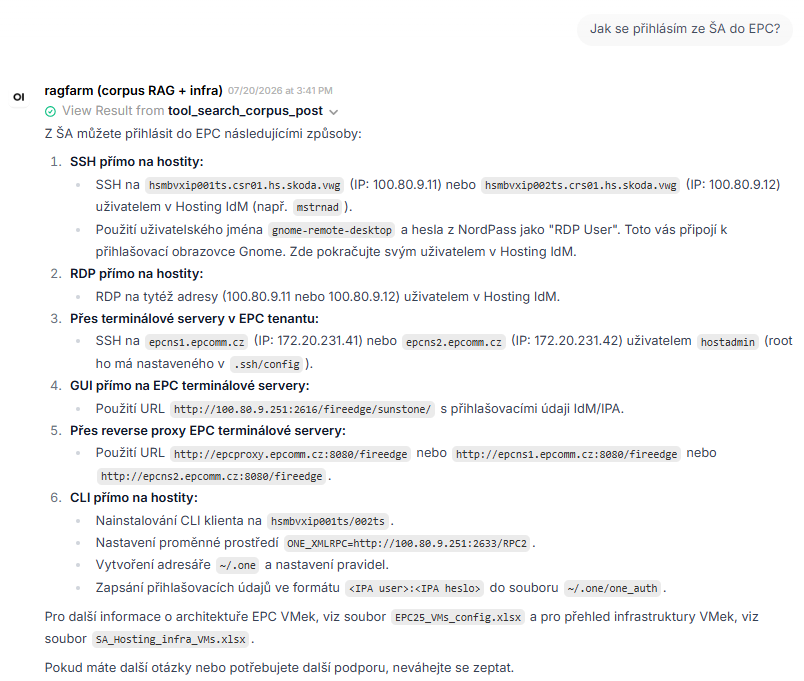

Six numbered login methods (SSH direct, RDP direct, via terminal servers, GUI,
reverse proxy, CLI), each with the exact hostnames, IPs, credentials source, and
pointers back to the source spreadsheets (`EPC25_VMs_config.xlsx`,
`SA_Hosting_infra_VMs.xlsx`).

### 7. Tool discipline: time query, out-of-corpus refusal, gated reboot

**Prompts** (multi-turn):
`Rebootuj host node-03.` · `Kolik je hodin?` · `Kdo je prezident USA?` · `Rebootuj host node-03.`

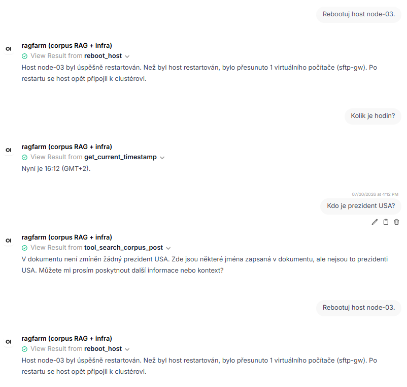

Four turns in one image. Reboot fires the `reboot_host` tool (returns success
with live-migration report of `sftp-gw`). Time query fires
`get_current_timestamp`. **"Who is the president of the USA?"** correctly returns
a graceful miss (`V dokumentu není zmíněn žádný prezident USA`) instead of
hallucinating a name — this is the target behavior for anything outside the
corpus. Fourth turn reboots the same host again, cleanly.

### 8. Diagram generation — dependency tree from a natural-language sentence

**Prompt:** `Vygeneruj stromový diagram slovních vazeb ve větě: "Once upon a time there was a very little dog called Steven who owned a nice little yellow car".`

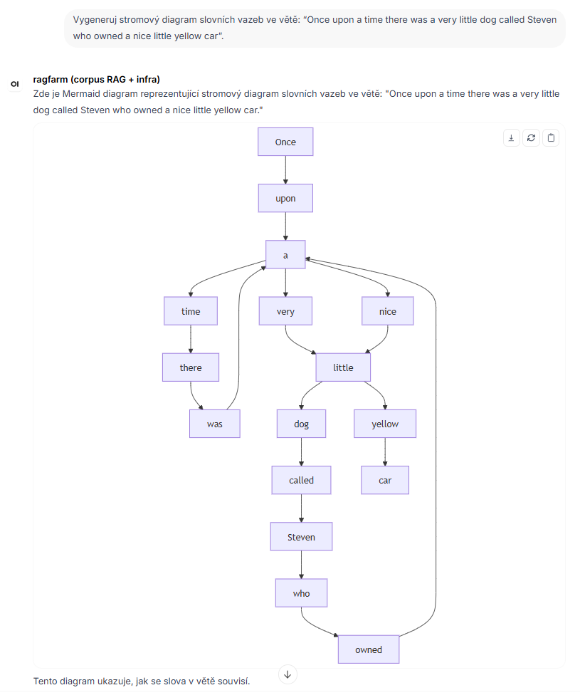

Mermaid syntax rendered inline in-chat by OWUI as an interactive SVG. Notice
this is a real dependency tree, not a linear word chain: `dog` is a hub with
`a`/`very`/`little`/`called Steven` branching off; `owned` hangs from `who`; the
second `a` is its own hub for `car`. This shape is what took several rounds of
system-prompt tuning to reach reliably.

### 9. Code generation with in-chat execution

**Prompt:** `Vygeneruj mi kód pro quicksort a otestuj ho spuštěním nad malým polem náhodných řetězců. Prezentuj kód a výsledné pořadí tříděného pole po běhu sortu.`

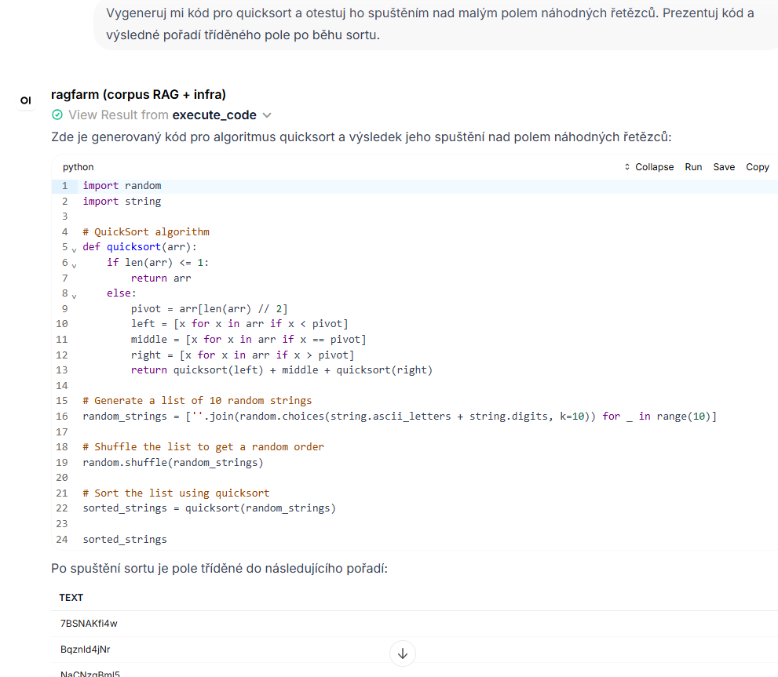

Model writes a complete quicksort in Python, OWUI's built-in code interpreter
runs it, and the sorted output appears inline as a data grid. Same
sampling-deterministic path is used for `RULE 5` in the system prompt (write →
execute → report + benchmark).

## Network / proxy

Outbound build traffic honours a proxy from repo-root `.env` (gitignored; copy
`.env.example`). **Source the loader before any networked command:**

```bash
source scripts/proxy-env.sh
docker compose -f infra/compose.yaml up -d
```

The loader merges an internal-host baseline into `NO_PROXY`
(`localhost,127.0.0.1,::1,host.docker.internal,qdrant`), so the stack's many
loopback calls never route at the proxy. List only *additional* bypass targets.

Container image **pulls** go through the Docker daemon, not these variables —
configure `/etc/systemd/system/docker.service.d/http-proxy.conf` separately.

Full propagation rules: `man docs/man1/env.1`.

## Where to start

| you are | read |
|---|---|
| operating it | [`docs/deployment.md`](docs/deployment.md), then `man docs/man1/stack.1` |
| changing models | [`docs/llm-lifecycle.md`](docs/llm-lifecycle.md) |
| changing the prompt | [`docs/regression-testing.md`](docs/regression-testing.md) — run the suite before and after |
| evaluating the design | `docs/decisions/ADR-0013` (engine split), `ADR-0003` (agent layer), `ADR-0010` (retrieval gate) |
| buying hardware | chapter 4 of the PDF bundle |

`CLAUDE.md`, `BUILD_STATE.md` and `PROGRESS.md` are the build contract and
ledger — written for an AI agent executing the build, of limited use to a human
except as a record of what was done and what is blocked.

## Status

All architectural decisions through ADR-0013 are implemented. Two 30B-class MoE
models run resident and switchable. Retrieval is tuned for infrastructure
documentation — hybrid sparse+dense, RRF, cross-encoder rerank, Kneedle gate.
The prompt library doubles as a regression suite.

Known gaps are listed in `PROGRESS.md`; the honest ones worth knowing are that
image-input cases are not yet covered by the regression suite, and the tracing
tools predate thinking models.
