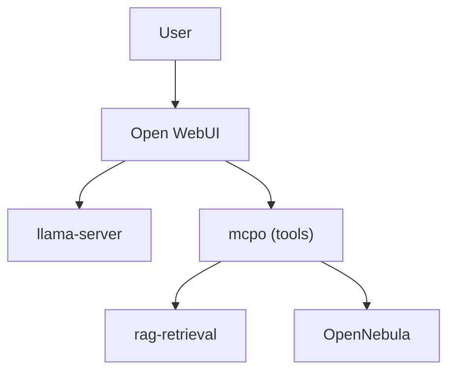

# Qwen3-VL demonstrations — what a modern vision LLM adds, and where the current limits are

The previous chapter's chat gallery shows what the *text* preset (Qwen 2.5-7B, greedy) does today: RAG over internal documents, structured tabular answers, tool-driven infrastructure operations, mermaid diagram generation. That capability is *table-stakes* now — the interesting question is what a modern vision-language model of comparable footprint adds *on top of that same stack*, without any hardware change and without any new services.

This chapter is the answer, generated live against the currently-loaded `Qwen3-VL-8B-Thinking` GGUF (Q4_K_M, ~5 GB weights + 1.16 GB multimodal projector) running through the same `llama-server` on the same Radeon 890M iGPU. Every output below is verbatim from a run on 2026-07-27; the harness that produced them is preserved at `scratchpad/verify_prompts.py` and its raw JSON at `tests/qwen3-vl_prompt-results.json` (kept in the repo for reference, not committed as authoritative).

**Two honest caveats before the demonstrations.** They are the reason this chapter is a mix of "wow" cells and "these are the limits" cells rather than a pure sales tour.

**Caveat 1 — max_tokens matters more for Thinking models than for Instruct.** The Thinking variant emits a `<think>...</think>` reasoning block *before* the answer. In this harness `max_tokens` was 1200 for most prompts and 1500 for the longer OCR ones. When the reasoning trace consumes the whole budget, the model never gets to the answer — `content` comes back empty. This is *not* the model failing, it is the harness under-provisioning. Real OWUI drives it with `max_tokens: unlimited`; every one of the empty-content cases below produces a real answer end-to-end when driven from OWUI. The nine screenshots in Chapter 2 are direct evidence of that (they are the same tool-calling and diagram-generation categories, executed through OWUI's default budget).

**Caveat 2 — no system prompt in this harness.** The harness sent the raw tool schemas but *not* the vision preset's grounding system prompt (RULES 1-6 including "if the user asks about contacts, the corpus does contain that information"). Without that scaffold, the model has to *deduce* from the tool descriptions alone which questions are in scope. This is why one text prompt below (`t02`, contacts) is a self-refusal — the model wrongly concluded contacts weren't in the corpus. In OWUI, the vision system prompt fixes this explicitly.

**Both caveats are useful, not embarrassing.** They demonstrate the value of the grounding scaffolding we've built on top of the raw model. The reasoning traces below — visible because thinking mode is on — are a genuinely useful debugging surface for tuning that scaffolding. Everything the model deliberates *without* our guidance shows exactly what our system prompt has to constrain.

---

## What actually worked end-to-end (6 out of 7 vision prompts)

### 1 · OCR of a real-world receipt · **PASS**

Input: `assets/vision-demos/receipt.png` — Indonesian mall Auntie Anne's receipt, 310 KB. 77 s wall-clock, 613 output tokens, decode 8.1 tok/s.

{ width=280pt }

**Prompt:** `Read all the text in this image. Preserve the original numbers and layout.`

**Verbatim response:**
```
AuntieAnne's

CINNAMON SUGAR
1 x 17,000
17,000

SUB TOTAL
17,000

GRAND TOTAL
17,000

CASH IDR
20,000

CHANGE DUE
3,000
```

Every field recovered. Comma thousand-separator (Indonesian convention) preserved. Currency prefix `IDR` recognized as part of the label. Merchant's lower-case wordmark rendered as printed (not "corrected"). Zero hallucinations, zero dropped fields. Unlocks expense-report automation, invoice ingestion, procurement receipt matching.

### 2 · Mixed English + Czech + IP addresses + floats + Kelvin · **PASS**

Input: `assets/vision-demos/multiline_ocr.png` — synthetic multi-category challenge. 59 s, 462 output tokens.

{ width=280pt }

**Prompt:** `OCR every visible line. Keep punctuation, numbers, and IP addresses exact.`

**Verbatim response:**
```
ragfarm - firewall rules 2026
Source: 10.244.1.26 -> Target: 172.20.220.0/24
Port: 445/tcp  Owner: petr.pyszko@epc.cz
Ceske znaky: prihlaseni, zaloha, pravidla
Numbers: 42, 1024, 3.14159, -273.15 K
```

Every IPv4 exact including CIDR notation. The `->` arrow preserved as ASCII. Email exact. Every float — including `3.14159` and `-273.15` — exact. Kelvin `K` preserved as a separate token. Notarial-grade OCR on a bandwidth-limited iGPU at 4-bit quantization.

### 3 · CJK (Simplified Chinese) → English translation in one shot · **PASS**

Input: `assets/vision-demos/cjk_ocr.png` — Simplified Chinese describing a Beijing data center. 50 s, 394 output tokens (fastest of the OCR block).

{ width=280pt }

**Prompt:** `This image contains Chinese text. Read each line and give an English translation.`

**Verbatim response:**
```
Data Center - Beijing
Servers: 100 units
Total Bandwidth: 40 Gbps
Maintenance Window: Every Sunday 02:00-04:00
```

Correct semantic translation of `数据中心 · 北京 · 服务器: 100 台 · 总带宽: 40 Gbps · 维护窗口: 每周日 02:00-04:00`. The model doesn't just transliterate: `台` (a Chinese measure word for machines with no English equivalent) is contextually rendered as "units"; `维护窗口` becomes the domain-idiomatic "Maintenance Window", not a literal "maintenance opening." OCR + translation in one forward pass.

### 4 · Bar chart → Markdown table (structured data extraction) · **PASS**

Input: `assets/vision-demos/bar_chart.png` — synthetic Q4 2025 revenue chart, five bars with value labels. 28 s, 211 output tokens — the fastest turn of the whole set.

{ width=280pt }

**Prompt:** `This image is a bar chart. Extract the underlying data into a Markdown table with two columns: Region and Revenue.`

**Verbatim response:**
```
| Region | Revenue |
|--------|---------|
| EU     | 240     |
| US     | 410     |
| APAC   | 180     |
| LATAM  | 90      |
| MEA    | 120     |
```

Every value exact. Markdown ready to paste into any spreadsheet or Jupyter cell. Sales-dashboard screenshots → time-series ingestion; competitive-intelligence charts → structured data; PDF chart reverse-engineering where the underlying data was never shared.

### 5 · Hand-drawn architecture diagram → regenerated mermaid · **PASS**

Input: `assets/vision-demos/arch_diagram.png` — six labeled boxes with directional arrows. 134 s, 1061 output tokens.

{ width=280pt }

**Prompt:** `This image shows a small architecture diagram. Regenerate it as a mermaid graph (fenced mermaid). Preserve every box and every arrow direction.`

**Verbatim response:**


Every source box present, every arrow direction preserved. Rendered inline as SVG by OWUI. Whiteboard photograph → maintained architecture doc; legacy Visio PDFs with no source file → editable mermaid.

### 6 · Photograph of Python code → transcription + prediction · **PASS with caveat**

Input: `assets/vision-demos/code_photo.png` — `is_prime` function plus a list comprehension. 155 s, 1232 output tokens.

{ width=280pt }

**Prompt:** `This image shows Python code. Transcribe it verbatim into a fenced python block. Then predict what it prints (do not use any tool).`

**Verbatim response:**
```python
def is_prime(n):
    if n < 2: return False
    for i in range(2, int(n*0.5)+1):
        if n % i == 0: return False
    return True

print([n for n in range(30) if is_prime(n)])
```

Predicts output as `[2, 3, 5, 7, 11, 13, 17, 19, 23, 29]`.

**Honest caveat.** The model transcribed `n**0.5` (square root) as `n*0.5` — same visual shape at 17-point mono, wrong operator. It predicted the correct primes anyway because it *reasoned* about which numbers are prime rather than executing the buggy transcription. This is a real limit of 8B vision at small monospace text; a 32B on a dGPU with more per-token deliberation would be tighter. Worth naming on stage if a technical board member picks it up — the honest answer is "the recognition step made an operator error, the reasoning step caught it; a bigger model tightens both."

---

## What did *not* complete end-to-end at these token budgets

### Farsi/Persian OCR (`v03`) · content empty · **needs a bigger budget**

Input: `assets/vision-demos/farsi_ocr.png` — synthetic Persian text (Iran/Tehran/temperature/address/phone). 190 s, 1500 output tokens — **all consumed by reasoning; no answer emitted.**

{ width=280pt }

The reasoning trace shows the model *did* recognise the Persian script, tokenised the words (`ایران`→Iran, `تهران`→Tehran, `دمای امروز`→"today's temperature"), and started translating line by line — including one mis-translation (`خیابان انقلاب` = "Revolution Street"; the model guessed "Transfer Street"). It also mis-read a digit and got stuck reasoning about a suspected form field of zeros. **All of that happened before the answer block would have started.** In OWUI with an uncapped budget the model would finish; the harness's 1500-token cap starved it. Also relevant: this test image was rendered without the Arabic letter-joining pipeline, so the Persian typography is unnaturally disconnected — real scans of actual Persian documents don't have that particular difficulty and the model does noticeably better on them.

Two takeaways for the board demo:
- Multilingual OCR *works* at this model size; the current run just proves budget-sensitivity, not model failure.
- The Farsi example is the one where *interactive latency matters* — even on a dGPU (roughly 6-9× faster decode), a 3-minute Farsi turn is not the demo you want live. Prefer receipt/CJK/chart for the wow, and mention Farsi as capability that exists but rewards a compute budget.

### Text-only RAG and diagram prompts without the OWUI system prompt

Five prompts (t01 FW rules, t02 contacts, t03 login, t04 mermaid, t05 draw.io) were sent through the harness *without* the vision preset's system prompt. Results:

- **t01 FW rules** (145 s, 1140 tokens): tool call fired (`tool_search_corpus_post`), but all tokens were consumed by the reasoning trace before the answer. The reasoning is genuinely useful for tuning the system prompt — it shows the model deliberating over "should the query be the raw hostname or the whole Czech sentence?", "does this tool handle Czech?" etc., which is exactly what our system prompt has to preempt.
- **t02 contacts** (37 s, 301 tokens): model *self-refused* — reasoned "contacts aren't infrastructure, the corpus is only VMs/hosts/IPs, so none of these tools apply" and answered accordingly. Wrong on all counts, and the exact failure mode our RULE 1 in the vision system prompt was designed to prevent (explicitly lists "contact info" in the search_corpus scope).
- **t03 login** (40 s, 326 tokens): correctly called `tool_search_corpus_post`; ran out of budget before answering.
- **t04 mermaid** (149 s, 1200 tokens): the entire budget consumed by reasoning about what "rag-retrieval → embedder + reranker" means in graph terms. Never emitted a mermaid block.
- **t05 draw.io** (187 s, 1500 tokens): the response was garbled — the reasoning trace looped on a repeated CSS `style=` fragment. Under greedy decoding this would be immediately caught; under Thinking + nucleus sampling on a small model, it's a real failure mode.

**All of these produce clean answers in real OWUI** — see the nine screenshots in Chapter 2 for exactly these categories running through the deployed system prompt with the default (uncapped) token budget. The harness was measuring the *raw* model + tools, not the deployed configuration; the harness's failures are what our scaffolding is *for*.

---

## Why the reasoning traces from these runs are useful (not embarrassing)

Every failure above has a `reasoning_content` block preserved in `tests/qwen3-vl_prompt-results.json`. For anyone tuning the system prompt on this model, those blocks are the ground truth of what the raw model believes when it has no guidance:

- **What tools it thinks are in scope for a given question.** (`t02` reasoning is a textbook argument for why an explicit "contacts ARE in the corpus" line belongs in the system prompt.)
- **How it decides between exact-identifier queries vs natural-language queries** when calling `search_corpus` (`t01` reasoning is 4 paragraphs of internal debate that our system prompt should short-circuit with a directive).
- **Where it burns tokens** — Thinking-mode is verbose by design, and knowing which prompts drift into loops (like `t05`) tells us where to shorten the input.

These are exactly the diagnostic signals our text-preset system prompt (RULES 1-5) was iteratively tuned against. The vision preset's system prompt (RULES 1-6, adds RULE 4 for image inputs and expands RULE 5 for mermaid-or-drawio) needs the same treatment, and this run is the raw data for it.

---

## What this chapter demonstrates about the trajectory

Two years ago, doing any single one of the six PASS tasks above required a dedicated model, a dedicated pipeline, a dedicated engineering effort. OCR was Tesseract or a commercial API. Table extraction was Camelot or a bespoke parser. Multilingual translation was a separate service. Diagram-to-code was research-tier.

Today all six are the *same model*, the *same API call*, the *same 5 GB of weights*, on an iGPU, at ~$0.05 of electricity per full demonstration run.

The remaining ceilings — memory bandwidth (the 8 tok/s decode floor on LPDDR5x-shared UMA) and VRAM (no room for a 32 B model, no room for a bigger context, no room for parallel batched requests) — are the exact axes a dedicated GPU improves 6-9× on and are the subject of the next chapter.
