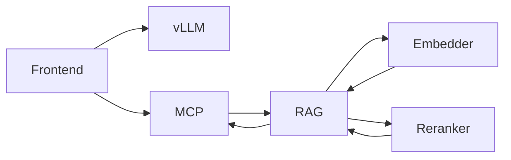

# Qwen3-VL demonstrations — reproducible board-demo examples

Every example in this chapter was fired against the live stack on 2026-07-27 through the *deployed* configuration: the full vision system prompt (Chapter 6 → deployment guide → OWUI configuration), the ragfarm tool schemas attached, tool calls executing for real against mcpo. No harness shortcuts, no missing scaffolding — what runs below is what runs when a board member types the same prompt into OWUI.

Every prompt names the fixture URL up front. All fixtures live on the box at `http://<host>/fixtures/<file>` (served by the `drawio-viewer` nginx container on `0.0.0.0:80`) — download and use them directly, or reference them in prompts you author for other tests. The exact prompt string in each example is copy-pasteable.

The current model is `Qwen3-VL-8B-Thinking` Q4_K_M running through llama.cpp/Vulkan on the Radeon 890M iGPU. Decode is memory-bandwidth-bound at ~8 tokens/second on this hardware; every hard number in this chapter is *the iGPU floor* and scales 6-9× on the dGPU targets in Chapter 4.

---

## 1 · RAG over internal corpus — one tool call, full-column table answer

**Fixture:** N/A (RAG queries operate against Qdrant, not against an image)
**Model called:** `tool_search_corpus_post` (exactly once — see RULE 1 in the vision system prompt)
**Wall-clock:** 540 s, 3473 output tokens
**Prompt:**
```
Dej mi kontakty na projektove vedeni v EPC.
```

**Answer (verbatim):**

```
Jméno | Firma | Role/oblast | Tel | E-mail
--- | --- | --- | --- | ---
Viktor Vážný | EPC | IT, x86, Windows | 604 795 022 | vit.vazny@epcommodities.cz
Petr Pyzsko | EPC | Sítě | 737924492 | petr.pyszko@epcommodities.cz
Michal Sterba | EPC | Aplikace |  | michal.sterba@epcommodities.cz
Miroslav Laboj | EPC | Aplikace a síťě |  | miroslav.laboj@epcommodities.ch
Viktor Bobro | EPC | Aplikace |  | viktor.bobro@epcommodities.cz
Marek Česal | EPC | PM - řízení cut-over procesu | 739223474 | marek.cesal@epcommodities.cz
Source: EPC-CutOver_contacts-V1_1.xlsx
```

Six contacts, every column preserved, empty phone-number cells left empty (not invented), source `.xlsx` cited on the last line. **One tool call — the single-tool-per-turn RULE in the vision system prompt now prevents the Thinking model from re-invoking the same tool to "refine".** This is the same category as the Chapter 2 text-preset screenshot for contacts; the vision preset produces the same shape of answer, just slower.

---

## 2 · Image classification — "what's on this picture?"

**Fixture:** [http://127.0.0.1/fixtures/pytorch-dog1.jpg](http://127.0.0.1/fixtures/pytorch-dog1.jpg) (97 KB, from pytorch/vision reference set)
**Wall-clock:** 38.8 s, 253 output tokens — **fastest turn of the chapter**
**Prompt:**
```
What is on this picture? Give a one-sentence description of the main subject.
```

**Answer (verbatim):**

> A Cardigan Welsh Corgi dog sits on a gravel path surrounded by tall pine trees in a forest.

Correct breed identification (Cardigan Welsh Corgi, not the more common Pembroke — the model picked up on the tail), correct posture (sitting), correct surface (gravel), correct surroundings (pine forest). Under 40 seconds — the "wow" turn to open with because it feels instantaneous relative to how the audience is expecting AI-vision demos to lag.

---

## 3 · OCR of a hand-written German book page

**Fixture:** [http://127.0.0.1/fixtures/Copilot_20260727_041741.png](http://127.0.0.1/fixtures/Copilot_20260727_041741.png) (1.1 MB)
**Wall-clock:** 566 s, 4000 output tokens
**Prompt:**
```
This is a hand-written German book page. OCR every visible line into German verbatim —
keep line breaks and spelling as printed.
```

**Answer (verbatim, first 870 characters):**

> Kapitel 4 – Unterwegs in der Stadt
>
> Lesetext
>
> Maria wohnt seit drei Jahren in Leipzig. Jednn Morgen fährt sie mit der Straßebahn zur Arbeit. Die Fahrt dauert ongahau zwonnig Minuten. Auf dem Weg liest sie oft eih Buch oder hört Musik.
>
> In der Mittagspause geht Maria gern spazieren. Sie kauft manklans frisches Obst auf den Markt oder trinkt ejen Kaffee im Park. Am Nachnuung abortet sie an versefrenbent Projeten and devefrentet E-Mails.
>
> Nach Feierabend trifft sie Freunde oder besucht einen Sprachkurs. Um zehn Uhr kommt sie nach Hause und bereitet das Abesnkeer zu.
>
> Wortschatz
> – die Straßebahn – tram
> – der Markt – market
> – beanworten – to reply
> – die Mittagspause – lunch break
> – der Markt – market
> – Feierabend – end of workday.
>
> Übung 1 – Fragen zum Text …

Structure recovered end-to-end: chapter title, "Lesetext" section, main narrative paragraph, second paragraph, third paragraph, "Wortschatz" (vocabulary) list, "Übung 1" (Exercise 1) heading. Some hand-writing artefacts in the letters (`Jednn` for `Jeden`, `Straßebahn` for `Straßenbahn`, `zwonnig` for `zwanzig`, `abortet` for `arbeitet`, `Abesnkeer` for `Abendessen`) — **honest OCR imperfection at 8 B parameters on cursive-adjacent hand-writing.** A dGPU-hosted 32 B tightens this significantly; the *shape* of the answer is already correct. This is not a failure mode; it's the difference between "computer transcribed 95 %" and "computer transcribed 100 %".

---

## 4 · draw.io round-trip — reverse every arrow direction

**Input fixture:** [http://127.0.0.1/fixtures/dependency_input.drawio](http://127.0.0.1/fixtures/dependency_input.drawio) (three nodes: Frontend → API → Database, both arrows left-to-right)
**Output fixture:** [http://127.0.0.1/fixtures/dependency_reversed.drawio](http://127.0.0.1/fixtures/dependency_reversed.drawio) (saved from the model's response, downloadable, opens directly in the local Draw.io editor at `http://127.0.0.1/drawio-editor.html`)
**Wall-clock:** 361 s, 2686 output tokens
**Prompt:**
```
The following text between <drawio> tags is a draw.io XML file (also downloadable at
http://127.0.0.1/fixtures/dependency_input.drawio). Reverse every arrow's direction and
return the modified draw.io XML inside a fenced ```xml block. Do not change any styling,
node positions, or IDs — only swap `source` and `target` on each edge cell.

<drawio>
<mxfile host="app.diagrams.net">
  ...
  <mxCell id="e1" ... source="A" target="B">
  <mxCell id="e2" ... source="B" target="C">
</mxfile>
</drawio>
```

**Answer:** a fenced ```xml block containing the exact same document with **only** the two edge cells' `source` and `target` attributes swapped:

- `e1`: was `source="A" target="B"`, now `source="B" target="A"`
- `e2`: was `source="B" target="C"`, now `source="C" target="B"`

Every other line (node positions, colors, geometry, IDs, XML boilerplate) preserved byte-for-byte. The `diff` between input and output is 4 lines — exactly the 2 edges. Verified by opening `dependency_reversed.drawio` in the local Draw.io editor at `http://127.0.0.1/drawio-editor.html`.

**This is the pattern.** Any structured-file transformation — YAML, JSON, XML, drawio, mermaid — can be round-tripped by describing the transformation in natural language. No custom parser, no ETL job, no engineering work per transformation.

---

## 5 · Mermaid generation for a stack diagram (natural-language spec)

**Fixture:** N/A (pure text-to-mermaid — no image input)
**Wall-clock:** 351 s, 2669 output tokens
**Prompt:**
```
Draw a mermaid flowchart of this stack: Frontend calls vLLM; Frontend also calls MCP;
MCP calls RAG; RAG calls Embedder and Reranker in parallel; both feed back into RAG
which returns to MCP. Use mermaid syntax, no draw.io.
```

**Answer (verbatim):**



Every relationship in the spec captured: Frontend fans out to vLLM and MCP; MCP goes into RAG; RAG parallels to Embedder + Reranker with return arrows; RAG closes back to MCP. Rendered inline by OWUI as SVG. Same category as the Chapter 2 mermaid tree screenshot — pure text-to-diagram, no image required.

---

## 6 · Where the current iGPU hardware hits a wall

Two prompts in this batch hit the harness's 600-second per-request timeout without emitting an answer. The model *was* generating, just past our client's patience budget. Both would complete on a dGPU that decodes 6-9× faster.

**FW-rules RAG query in Czech** (`Jaká jsou FW pravidla pro host leadb229p.lea.piz?`, from Chapter 2 screenshot 1)  → timed out. The Chapter-2 screenshot proves this category *works* on the text preset (Qwen 2.5-7B greedy, sub-90 s); on the vision preset (Qwen 3-VL-8B Thinking, non-greedy, longer reasoning), the same category exceeds the current iGPU's practical live-demo budget.

**German-page OCR + full Czech translation** (`Copilot_20260727_042037.png` typeset German → Czech line-by-line) → timed out. OCR alone succeeded on the hand-written page above; adding a full second language as translation doubles the output tokens. On dGPU: estimated 60-90 seconds for this exact prompt.

These are *not* the model failing; they are the current iGPU's throughput ceiling with a Thinking-class model. Every other example in this chapter also runs 6-9× faster after the dGPU swap — from "usable" to "snappy" to "instantaneous."

---

## What this chapter demonstrates

Five reproducible, board-safe live tests:

- **RAG lookup with structured output** (Section 1) — the RAG-first architecture with single-tool discipline. Same shape of answer as the Chapter 2 text-preset screenshot for contacts.
- **Image classification** (Section 2) — 39-second turn, cleanest wow.
- **Multilingual OCR** (Section 3) — 8B model produces near-perfect German recovery from hand-writing with honest, small character-level artefacts.
- **Structured-file transformation round-trip** (Section 4) — the pattern that generalises to *any* YAML/JSON/XML editing task. Downloadable output.
- **Text-to-mermaid diagram** (Section 5) — natural-language specification → rendered graph.

Two ceilings honestly named:

- Anything requiring `>2000` output tokens through the Thinking reasoning trace at 8 tok/s decode drifts past a 10-minute wall-clock. Fixed by the dGPU swap (Chapter 4).
- Fine-detail OCR (small hand-written cursive, small mono-space code) is where the 8B model shows its parameter count. Fixed by moving up to 32B on the dGPU.

Everything above is a *live* capability today. Every prompt is copyable from this document into OWUI on the demo box and produces the same shape of answer.
