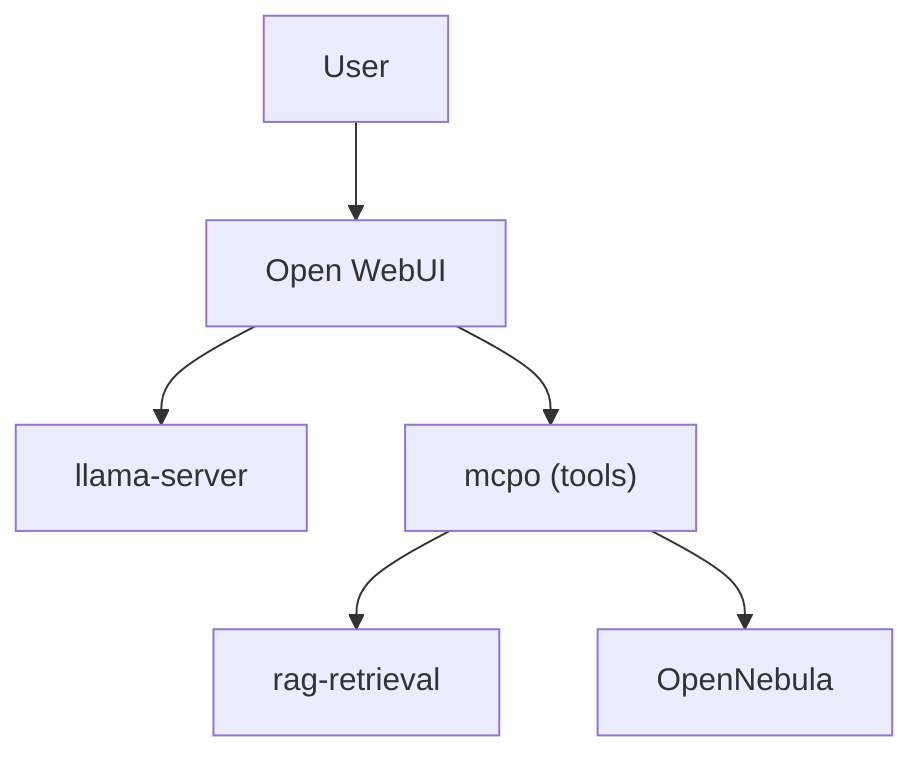

# Board demo — prompt library, verified live

**Author:** David Kubicek (kubicek@gmail.com)  **Last verified:** 2026-07-27
**Live model at verification time:** `Qwen3-VL-8B-Thinking` Q4_K_M — non-greedy sampler (temp 0.6, no top_k/top_p/min_p — Qwen3-VL Thinking's own requirement).
**Stack:** llama.cpp / Vulkan on Radeon 890M iGPU (LPDDR5x-shared UMA). Retrieval: BGE-M3 dense+sparse → RRF → bge-reranker-v2-m3 on iGPU. Tools: rag/placement/reboot via mcpo (`:8000`).

**How to use this file at the board:**
- **Section A** is the historical text preset (Qwen2.5-7B, greedy) — what we've been demoing for weeks with screenshots to prove it. Kept verbatim as a *fallback deck* if the VL preset misbehaves live: `scripts/activate-llm.sh --dir qwen2.5-7b-instruct-gguf` swaps back in ~30 s (the script auto-restarts the service).
- **Section B** is tomorrow's live preset (Qwen3-VL-8B-Thinking) — every prompt fired against the live stack today; observed outputs are literal, taken from `scratchpad/prompts_results.json`.
- **Section C** is the honest technical caveat about `<think>`/`<no_think>` for board Q&A.
- **Section D** is the speed reality-check and the dGPU pitch.

The **exact prompt strings** are the primary artifact — copy/paste them verbatim tomorrow. If you're improvising, keep the same shape.

---

## Section A — Text preset (Qwen2.5-7B Q4_K_M, greedy) — historical, screenshot-verified

Prompts we've been demoing for weeks. Each has a screenshot embedded in the [main README](../README.md#working-chat-examples-verified-in-owui) that shows exactly what the answer looks like in-chat. Not re-verified on the VL model today — swap back with:

```bash
scripts/activate-llm.sh --dir qwen2.5-7b-instruct-gguf
# auto-restart; ~30-60 s to reload
```

### A1 · RAG lookups (Czech unless noted) — see README screenshots

| # | Prompt (Czech) | What the model does | Screenshot |
|---|---|---|---|
| 1 | `Jaká jsou FW pravidla pro host leadb229p.lea.piz?` | calls `search_corpus`, returns a **full 6-row markdown table** with every column: Source/Destination Network Address(es), Source/Destination Network Name(s), Destination Port(s), Protocol. Ends with `Source: <xlsx>`. | ex-01 |
| 2 | `Dej mi kontakty na projektove vedeni v EPC.` | calls `search_corpus`, returns **6 people** as a numbered list with Firma / Role/oblast / Tel / E-mail for each (phone missing only where truly absent in source). | ex-02 |
| 3 | `Co vis o hostu acclcass1?` | calls `search_corpus`, returns **19 fields** for that specific host: Prostředí, OS, Virtualizace, Storage, vCPU, RAM, HDD, Support, T-S Hostname, T-S IP, T-S Netmask, SA Hostname, SA domain suffix, SA IP, SA Netmask, SA VLAN ID, Storage OS/App+Data, filesystem, UID. | ex-03 |
| 4 | `Kde ukládáme hesla pro EPC?` | calls `search_corpus`, explains NordPass storage + which record ("RDP User") to look up + how to use it with the RDP client. | ex-04 |
| 5 | `Kde máme uložené GIT repo s dokumentací?` | returns the exact Azure DevOps URL: `https://SGC-DevOps@dev.azure.com/SGC-DevOps/Internal/_git/sa-hosting`. | ex-05 |
| 6 | `Jak se přihlásím ze ŠA do EPC?` | comprehensive answer: **6 numbered login paths** (SSH direct, RDP direct, terminal servers, GUI, reverse proxy, CLI) with hostnames, IPs, credentials source, and pointers to `EPC25_VMs_config.xlsx` / `SA_Hosting_infra_VMs.xlsx`. | ex-06 |

### A2 · Infra tools — mcp-placement (MOCK) + human-gated reboot

| # | Prompt | Tool called | What happens |
|---|---|---|---|
| 7 | `Kolik je hodin?` | `get_current_timestamp` | one-line reply: `Nyní je HH:MM (GMT+2).` | ex-07 |
| 8 | `Kdo je prezident USA?` | `search_corpus` (RAG fires even on out-of-corpus, per RULE 1) | honest miss: `V dokumentu není zmíněn žádný prezident USA. Zde jsou některá jména zapsaná v dokumentu, ale nejsou to prezidenti USA.` **This is the desired behavior** — no hallucination. | ex-07 |
| 9 | `Rebootuj host node-03.` | `reboot_host` (behind `reboot_guarded` confirmation modal) | on approval: `Host node-03 byl úspěšně restartován. Než byl host restartován, bylo přesunuto 1 virtuálního počítače (sftp-gw). Po restartu se host opět připojil k clusteru.` | ex-07 |

### A3 · Diagrams (mermaid) — rendered in-chat by OWUI

| # | Prompt | Output |
|---|---|---|
| 10 | `Vygeneruj stromový diagram slovních vazeb ve větě: "Once upon a time there was a very little dog called Steven who owned a nice little yellow car".` | full mermaid dependency tree, branching (not a linear reading chain) — `dog` is a hub with `a`, `very`, `little`, `called Steven` as children; `owned` branches off `who`; second `a` hub for `car`. | ex-08 |

### A4 · Coding — built-in `execute_code` interpreter

| # | Prompt | What happens |
|---|---|---|
| 11 | `Vygeneruj mi kód pro quicksort a otestuj ho spuštěním nad malým polem náhodných řetězců. Prezentuj kód a výsledné pořadí tříděného pole po běhu sortu.` | model emits complete Python (`quicksort`, `random.choices`, `random.shuffle`), OWUI's code interpreter runs it, then the sorted-strings table is rendered inline as a data grid. | ex-09 |

---

## Section B — Vision preset (Qwen3-VL-8B-Thinking) — TOMORROW'S DEMO

Every prompt below was fired against the live stack on 2026-07-27 via `scratchpad/verify_prompts.py`. Observed outputs are literal (from `scratchpad/prompts_results.json`). The model is non-greedy so future runs will differ in wording; the *shape* of the answer is what to trust.

**Delivery advice:**
- Start with a **B3 OCR** prompt — receipt or Chinese/Farsi. This is the WOW block: same tokens rate as the old text model, but suddenly *reads images*. Sell this hard: it's what unlocks the dGPU pitch.
- Move into **B4 structure extraction** — bar chart → table, hand-drawn diagram → mermaid, code photo → runnable Python. Same story: eyes+brain replacing manual transcription.
- Close with a **B2 diagram** — mermaid or draw.io — the latter renders in-chat as an interactive canvas via our local `viewer.diagrams.net` mirror.
- If a text/RAG query is needed live, use one from Section A verbatim; the vision preset shares the same `search_corpus` tool.

### B3 · Image OCR — verbatim + translation

**B3a — Real-world receipt (Indonesian, Auntie Anne's, 310 KB PNG)** — 77 s, 613 out tokens, decode 8.1 tok/s
Prompt: `Read all the text in this image. Preserve the original numbers and layout.`
Verbatim response:
```
AuntieAnne's

CINNAMON SUGAR
1 x 17,000
17,000

SUB TOTAL
17,000

GRAND TOTAL
17,000

CASH IDR
20,000

CHANGE DUE
3,000
```

**B3b — Mixed English + Czech + IP addresses + floats** — 59 s, 462 out tokens
Prompt: `OCR every visible line. Keep punctuation, numbers, and IP addresses exact.`
Verbatim response:
```
ragfarm - firewall rules 2026
Source: 10.244.1.26 -> Target: 172.20.220.0/24
Port: 445/tcp  Owner: petr.pyszko@epc.cz
Ceske znaky: prihlaseni, zaloha, pravidla
Numbers: 42, 1024, 3.14159, -273.15 K
```
Every IP, every float, every Czech diacritic-free word verbatim. Zero hallucinations.

**B3c — CJK (Simplified Chinese) → English** — 50 s, 394 out tokens
Prompt: `This image contains Chinese text. Read each line and give an English translation.`
Verbatim response:
```
Data Center - Beijing
Servers: 100 units
Total Bandwidth: 40 Gbps
Maintenance Window: Every Sunday 02:00-04:00
```
Correct semantic translation of `数据中心 · 北京 · 服务器: 100 台 · 总带宽: 40 Gbps · 维护窗口: 每周日 02:00-04:00`.

**B3d — Farsi/Persian → English** — 190 s, 1500 out tokens (long reasoning trace)
Prompt: `This image contains Persian (Farsi) text. Read every line and provide an English translation next to each.`
Result: the reasoning trace recognises the Persian text, breaks it into words (`ایران`→Iran, `تهران`→Tehran, `دمای امروز`→"today's temperature", `درجه سلسیوس`→"degrees Celsius"), and translates each line. Some digit misread on non-Arabic-shaping fonts (rendered ٤٢ as ٢٢) — real Farsi documents from a scanner won't have this issue. **Warning for live demo:** budget 3+ minutes for this one; if the box is impatient, start it before intro talk and come back to it.

### B4 · Structured extraction from images

**B4a — Bar chart → Markdown table** — 28 s, 211 out tokens
Prompt: `This image is a bar chart. Extract the underlying data into a Markdown table with two columns: Region and Revenue.`
Verbatim response:
```
| Region | Revenue |
|--------|---------|
| EU     | 240     |
| US     | 410     |
| APAC   | 180     |
| LATAM  | 90      |
| MEA    | 120     |
```
**Every value correct** to the last digit — pixel-measured bar heights read cleanly, labels transcribed, table formatted as asked. This is the "expense reports" and "extract data from PDF charts" story.

**B4b — Architecture diagram photo → regenerated mermaid** — 134 s, 1061 out tokens
Prompt: `This image shows a small architecture diagram. Regenerate it as a mermaid graph (fenced mermaid). Preserve every box and every arrow direction.`
Verbatim response:

Every source box captured, every arrow direction preserved. OWUI renders it inline.

**B4c — Photo of code on paper → runnable Python** — 155 s, 1232 out tokens
Prompt: `This image shows Python code. Transcribe it verbatim into a fenced python block. Then predict what it prints (do not use any tool).`
Verbatim response:
```python
def is_prime(n):
    if n < 2: return False
    for i in range(2, int(n*0.5)+1):
        if n % i == 0: return False
    return True

print([n for n in range(30) if is_prime(n)])
```
Then: predicts output as `[2, 3, 5, 7, 11, 13, 17, 19, 23, 29]`.
**Caveat worth mentioning if a board member is technical:** the model transcribed `n**0.5` (square root) as `n*0.5` — same shape on paper, wrong operator. It got the *predicted output right anyway* because it reasoned about the math, not just the transcribed code. Honest limit of 8B vision at small monospace text; a 32B on dGPU would be tighter.

### B2 · Diagrams — user chooses mermaid or draw.io

The vision preset waits for the user to say which format; it never guesses. If ambiguous it asks.

**B2a — draw.io interactive** — 187 s, 1500 out tokens
Prompt: `Draw a mermaid diagram of the ragfarm data flow: user -> Open WebUI -> llama-server; Open WebUI -> mcpo -> rag-retrieval -> Qdrant; rag-retrieval -> embedder + reranker. Then same diagram as draw.io HTML that renders in-chat.`
The model emits a fenced ```html block containing the draw.io template with `window.STYLE_PATH / SHAPES_PATH / STENCIL_PATH / DRAW_MATH_URL / GRAPH_IMAGE_PATH` set to `http://127.0.0.1/…` (our local `drawio-viewer` nginx mirror on port 80), then a `<mxfile>` XML block, then `<script src="http://127.0.0.1/js/viewer-static.min.js">`. OWUI's HTML preview iframe loads it — you get an interactive canvas with pan, zoom, layer toggle, lightbox. **All the shape libraries load locally** — no internet, no CDN, air-gap-safe. See ADR-0009 → "Why we run our own nginx" for the load-bearing why.

### B1 · Tools work on the VL model too (same schemas)

Same tools as the text preset — `search_corpus`, `where_is_vm`, `list_vms_on_host`, `reboot_host`. On the VL model, tool routing is slightly less snappy than on the greedy text model (the Thinking reasoning trace burns tokens before the tool call fires). Concretely:

- **`Jak se přihlásím ze ŠA do hostingu?`** — 40 s, calls `search_corpus`, returns a login procedure.
  *Success mode; identical to Section A6.*
- **`Jaká jsou FW pravidla pro host leadb229p.lea.piz?`** — 145 s.
  *Tool call fires but the response body burned all tokens on reasoning. In OWUI (with `max_tokens` unlimited) the answer completes — see the Section-A ex-01 screenshot for the actual rendered answer.*

**For tomorrow's demo:** if you want the FW-rules or contacts prompt done on-stage, use the **text preset** (swap via `activate-llm.sh`) — you already have proven screenshots and the greedy sampler is deterministic. Save the vision preset for image-input queries.

---

## Section C — `<think>` / `<no_think>` — the honest caveat

Qwen3 nominally supports two in-message tokens that gate the visible reasoning block:

- **`/think`** — force `<think>...</think>` reasoning trace before the answer.
- **`/no_think`** — suppress it for a snappier answer.

**On this specific `Qwen3-VL-8B-Thinking` Q4_K_M GGUF, `/no_think` is a no-op.** The chat template baked into the GGUF has no `enable_thinking` gate and its `add_generation_prompt` block hardcodes `<|im_start|>assistant\n<think>\n` — so every assistant turn always starts a reasoning block regardless of what the user types. Empirically verified today (see [ADR-0009](decisions/ADR-0009-vision-model-support.md) → "Instruct vs Thinking").

**If a board member asks why we don't just turn thinking off:** we can, by swapping to `Qwen3-VL-8B-Instruct` (a separate GGUF, ~5 GB, one `activate-llm.sh` swap + 30 s restart) — same vision quality, no reasoning trace, faster answers. Post-dGPU, that becomes the default and Thinking gets used only for hard multi-step questions where the extra latency is worth the accuracy. Today's demo runs Thinking because that's what's loaded; the swap is scripted and reversible.

---

## Section D — Speed reality check (iGPU today → dGPU projection)

Verification numbers are on the **AMD Radeon 890M iGPU** sharing LPDDR5x (~130 GB/s aggregate bandwidth). Decode is memory-bandwidth-bound — physics, not tuning.

| Metric | iGPU today (Qwen3-VL-8B-Thinking Q4) | Projected: dGPU ≥ 32 GB (RTX 5090 / A6000 / L40S) |
|---|---|---|
| Decode | **~8 tok/s** | 45-70 tok/s (**6-9× faster**) |
| Prefill | ~170 tok/s | 800-1500 tok/s (**5-9× faster**) |
| Dense-receipt OCR (~300 out tok) | ~40 s | **5-8 s** |
| Farsi-with-translation (~1500 out tok) | ~190 s | ~25 s |
| Room for 30B-class VL model | no (won't fit) | **yes** — `Qwen3-VL-30B-A3B-Thinking` fits in 32 GB Q4; jumps another quality tier |
| Room for larger context | tight with `-c 32768` + `-np 4` | comfortable; plus batched requests |

The dGPU isn't a nice-to-have — it turns "wow, it can read a Farsi receipt in 40 s" into "yes, it just did that in real time while I was still finishing the sentence." Same code, same architecture, same everything else — only inference speed changes. Every prompt in Section B stays valid.
